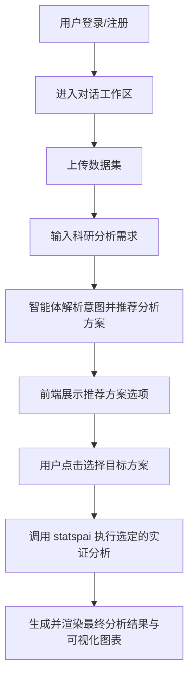

## 1. 产品概述
本项目是一个面向大学生的人文社科领域科研辅助商业化网页应用。
- 主要通过对话交互（类似 Coze 模式）满足用户的实证分析等专业科研需求，降低数据分析门槛。
- 目标用户为需要进行学术研究和数据分析的大学生、研究生及科研人员，具备显著的商业化市场价值。

## 2. 核心功能

### 2.1 用户角色与计费系统
本产品引入积分计费系统，不同操作消耗不同积分，用户可通过订阅或单独充值获取积分。
| 角色 | 注册方式 | 核心权限 |
|------|---------------------|------------------|
| 普通用户 | 手机号/邮箱注册 | 基础对话、小规模数据上传与分析、基础文献检索 |
| 订阅会员 | 支付订阅费用 | 高级智能体调用、大规模数据集分析、专业报告生成、高级宏微观数据提取 |

**积分计费标准（数据提供服务）**：
- **微观企业指标**：粒度最细，积分消耗最多。
- **宏观指标（省、市、县域级）**：按研究层面大小递减，县域级 > 市级 > 省级。
- **数据量大小**：输出数据的内存/行数越大，积分消耗按比例增加。

### 2.2 功能模块
1. **产品首页**：Hero Section、核心功能展示、商业定价方案、开始使用按钮
2. **对话工作区**：侧边栏历史记录、主对话窗口、分析结果及可视化图表展示面板
3. **数据管理与供应页**：
   - 用户自带数据：数据集上传、数据预览、预处理配置。
   - **内置科研数据库（新增）**：提供常用的上市微观企业指标及宏观指标（采用方案B：DuckDB + Parquet存储），用户可通过自然语言直接让智能体提取并提供静态年度数据。
   - **实时金融数据接口（规划中）**：接入第三方金融 API（Python 运行），支持用户实时查询最新的金融市场指标及动态数据，扩展内置数据源的时效性。
4. **文献检索与综述（新增）**：
   - 自动联网检索中英文高质量文献（中文涵盖知网、万方等免费公开或OA资源）。
   - 提供真实可靠的文献信息（论文题目、作者、摘要、真实可点击的原文链接）。
   - 自动生成结构化的文献综述。

### 2.3 页面详情
| 页面名称 | 模块名称 | 功能描述 |
|-----------|-------------|---------------------|
| 产品首页 | 介绍模块 | 轮播或动态展示科研分析案例，突出人文社科实证分析能力 |
| | 定价模块 | 展示不同会员等级的功能差异及价格 |
| 对话工作区 | 侧边栏 | 历史会话列表管理，新建对话 |
| | 核心对话区 | 输入框（支持文本、附件），对话气泡，流式输出内容 |
| | 结果展示区 | 动态渲染 statspai 返回的统计分析结果及可视化图表 |
| 数据管理页 | 上传模块 | 支持拖拽上传 CSV/Excel 文件 |

## 3. 核心流程
用户在首页了解产品后登录，进入对话工作区。用户上传数据文件并提出科研问题。应用采用“先智能推荐 → 用户选择 → 再执行”的工作流：
1. 用户输入科研分析需求。
2. 基于 deerflow 2.0 构建的后端智能体解析意图，智能推荐最适合的实证分析方案（如 OLS 回归、相关性分析等）。
3. 用户在前端页面点击选择具体的目标分析方案。
4. 智能体调用 statspai 执行被选中的实证分析。
5. 返回最终的分析报告和可视化图表给前端展示。

## 4. UI设计
### 4.1 设计风格
- 主副颜色：主色调使用深沉的科研蓝（#1D4ED8）搭配学术气息的象牙白或浅灰背景，营造专业、严谨且现代的学术感。
- 按钮风格：微圆角（4px-8px），现代简约，悬浮时有轻微的阴影或颜色渐变反馈。
- 字体及大小：标题使用优雅的无衬线字体（如 Inter 或 Roboto），正文保持清晰易读（14px-16px）。
- 布局风格：采用现代化的面板布局（类似 IDE 或 Coze 的多窗格结构），注重信息密度的合理分配。
- 图标风格：使用线条流畅、粗细一致的线性图标（如 Lucide Icons）。

### 4.2 页面设计概述
| 页面名称 | 模块名称 | UI元素 |
|-----------|-------------|-------------|
| 产品首页 | Hero Section | 大标题，科技感渐变背景，动态动效，CTA按钮 |
| 对话工作区 | 核心对话区 | 对话气泡（用户和AI区分背景色），Markdown及代码高亮支持 |
| | 结果展示区 | 交互式数据图表，数据表格，下载按钮 |

### 4.3 响应式
采用桌面端优先（Desktop-first）设计，针对复杂的对话和分析界面在宽屏下采用三栏布局；在移动端自动折叠侧边栏和结果展示区为抽屉式（Drawer）交互。
