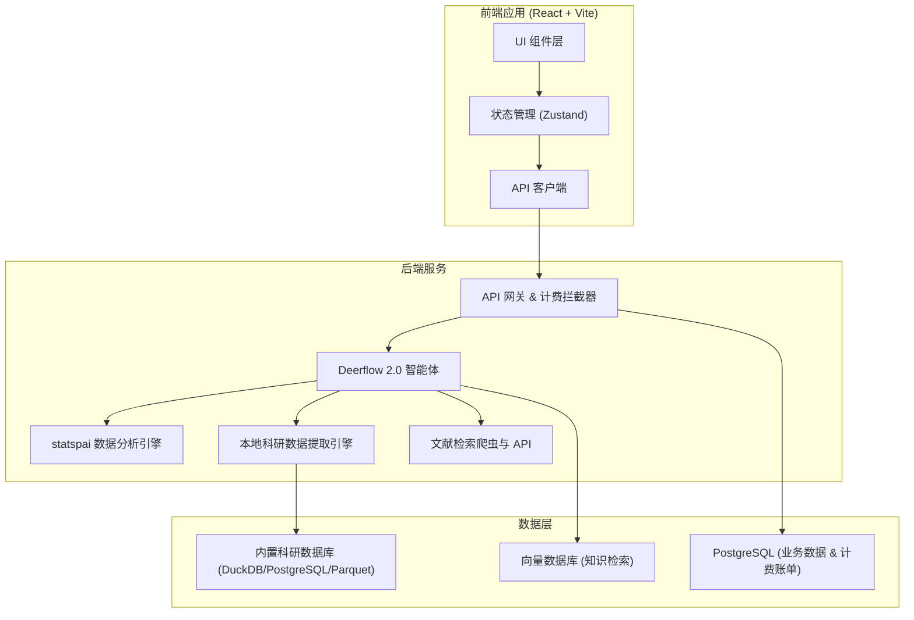
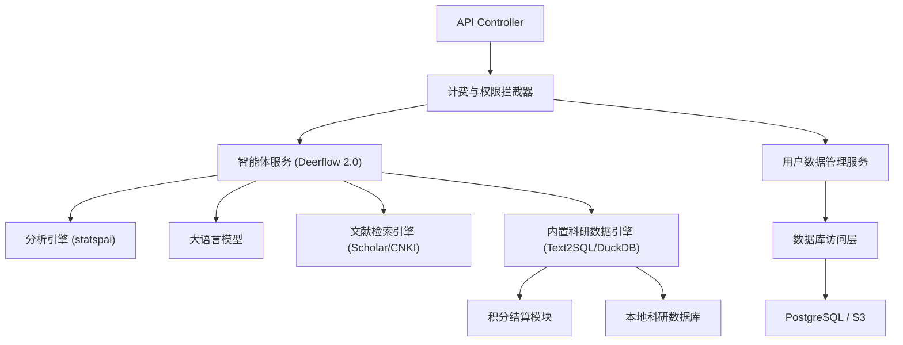
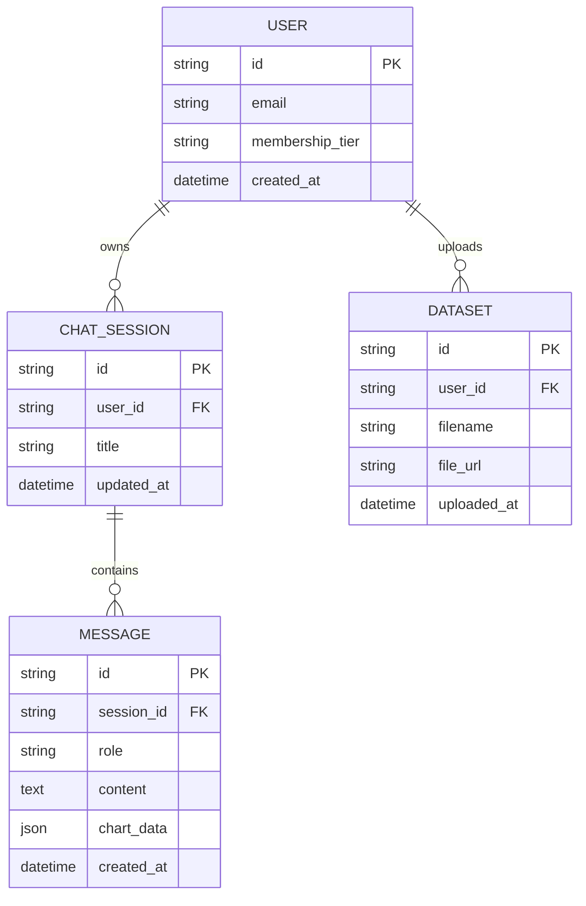

## 1. 架构设计


## 2. 技术说明
- **前端**：React@18 + tailwindcss@3 + vite
- **路由**：react-router-dom
- **状态管理**：zustand
- **图标与组件库**：lucide-react, shadcn/ui (Radix UI)
- **图表可视化**：recharts 或 echarts-for-react
- **Markdown渲染**：react-markdown (支持数学公式 rehype-mathjax 和代码高亮)
- **初始化工具**：vite-init
- **后端**：基于 Node.js/Python 构建 API，集成 Deerflow 2.0 智能体框架以及 statspai 进行核心业务处理。

## 3. 路由定义
| 路由 | 目的 |
|-------|---------|
| `/` | 商业化落地首页，产品介绍与定价 |
| `/chat` | 核心对话工作区 |
| `/chat/:id` | 特定历史对话工作区 |
| `/datasets` | 数据集管理页面 |
| `/login` | 用户登录/注册页 |

## 4. API 定义 (对接后端)
```typescript
// 1. 发送对话消息
interface SendMessageRequest {
  chatId: string;
  message: string;
  datasetIds?: string[];
}
interface SendMessageResponse {
  messageId: string;
  role: 'assistant';
  content: string; // Markdown 格式的回复或分析报告
  chartData?: any; // 结构化图表数据
}

// 2. 上传数据集
interface UploadDatasetResponse {
  datasetId: string;
  filename: string;
  rowCount: number;
  columns: string[];
}
```

## 5. 服务端架构图


## 6. 数据模型
### 6.1 数据模型定义

